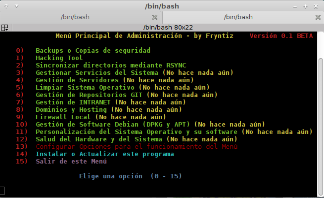

# Menú de Gestión Rápida (beta)
El objetivo principal de este script de administración es realizar operaciones básicas con una preconfiguración mínima y portable para crear backups, actualizar sistemas, sincronizar por rsync...

Este menú pretende facilitar la vida a los usuarios y administradores que repitan ciertas tareas



## Origen del menú
En principio el menú se va forjando alrededor de las necesidades que voy teniendo en mis equipos por lo que puede no ser útil para usted al 100% pero le ofrezco una base para crear su propio menú de gestión o colaborar en mejorar este que ya existe.

La idea es que reuna tareas básicas que generalmente utilizamos.

## Script en Bash y para Debian Stable
El sistema operativo usado como referencia es por mi parte en todo momento DEBIAN la versión estable última.

Esto no quita que la mayoría del script funcione en otras distribuciones (derivados de DEBIAN probablemente funcione por completo).

En cualquier caso, para otras distribuciones no costará demasiado portarlas o retocar la parte que no haga correctamente su trabajo.


## Modularidad
Intento que sea muy modular estando todo separado en diferentes archivos para garantizar una rápida localización.

Todas las configuraciones y rutas sobre las que trabajar estarán en todo momento dentro del directorio "preferencias" alojado en la raíz del script.

## Dependencias
Este script necesita dependencias para instalarse (las deberá satisfacer automáticamente pero en caso contrario en la raíz existirá un archivo llamado "Dependencias" que contendrá la lista de lo que necesita para andar por completo).


## Instalación
La instalación de este script junto con todas sus dependencias debe iniciarse mediante el script "instalador.sh" el cual puedes portar como único archivo para iniciar la instalación.

### Lugar de instalación
La instalación dejará un directorio en la raíz del usuario con el nombre ".SuperScriptBash" lo que es lo mismo a realizar un git clone de este repositorio:
```github
    git clone https://github.com/fryntiz/SuperScriptBash.git ~/.SuperScriptBash
```
Teniendo en cuenta que si no usas el instalador.sh no se resolverán dependencias de programas

## Actualización de esta herramienta
La actualización se programa sincronizando desde github mediante git y sobreescribiendo todos los archivos viejos por las nuevas versiones, menos los archivos dentro de "preferencias" que permanecerán inalterables y los archivos que vayan generando aplicaciones de terceros y sus temporales que permanecerán intactos.


## Otros detalles y aclaraciones
Por último aclarar que soy programador web y la mayor parte del menú se compone de Shell Script en bash y otros scripts en Python en algunos casos.

Lenguajes de programación que aprendo recientemente por lo que es probable que existan errores de sintaxis o maneras más eficientes de realizar ciertas tareas puesto que esta no es mi especialidad y en este momento me encuentro como único desarrollador. Aunque sin duda todo lo que pase a estable habrá sido totalmente comprobado y haber realizado correctamente su tarea.

Después de toda esta charla os dejo disfrutarlo y espero que os sea de alguna utilidad
